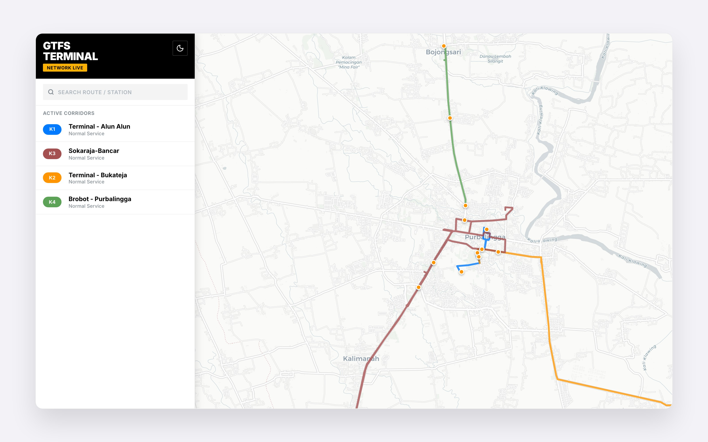
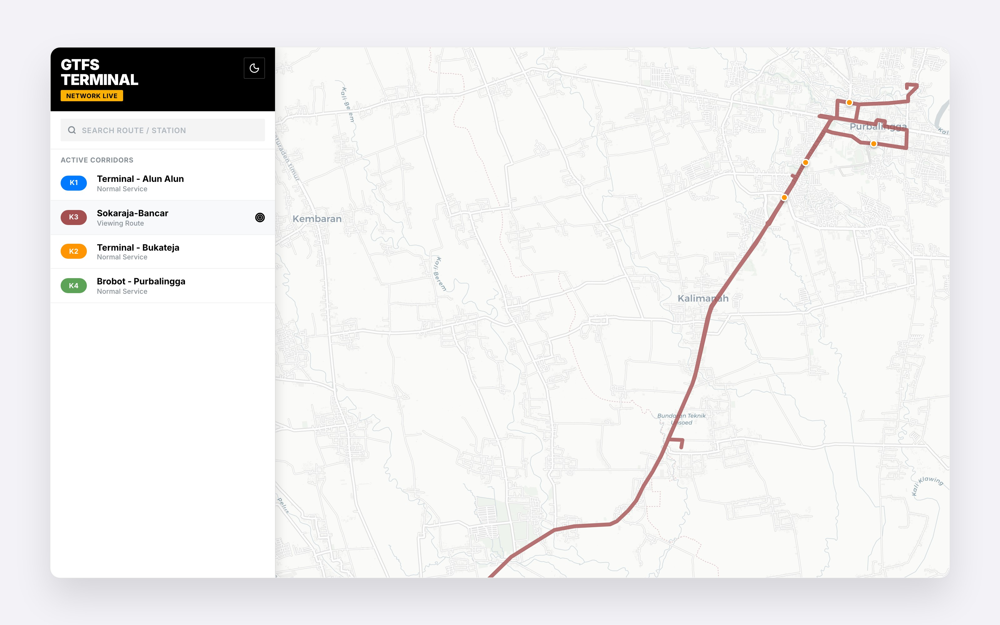

# GTFS Transit Management Platform

A professional, full-stack transit management ecosystem designed for designing, managing, and visualizing General Transit Feed Specification (GTFS) data. The platform features an immersive, GIS-desktop-inspired CMS and a modern public-facing live map.

## 🚀 Key Features

### 🛠 GTFS Studio (CMS)
*   **Unified Explorer**: High-density dashboard with a dynamic data manifest engine for Operators, Stops, Routes, and Trips.
*   **Map Designer**: Immersive GIS workspace with real-time road-following path construction (OSRM) and anchor-point snapping.
*   **Spatial Intelligence**: Multi-layer map highlighting with high-contrast "Halo Previews" for discovery and persistent selection states.
*   **Smart Node Hub**: One-click contextual stop-to-route assignments with automated reverse geocoding.
*   **Industrial Standard UX**: Draggable, collapsible hubs with "Ghost Mode" transparency during active map drawing.
*   **Deterministic Integrity**: Real-time topological health scoring and live system activity auditing.

### 🌐 Public Web Viewer
*   **Immersive Map**: Fullscreen map with glassmorphism HUD.
*   **Real-time Sync**: Automatically polls CMS changes every 5 seconds—updates appear live without refreshing.
*   **Route Discovery**: Intelligent search and highlighting; selecting a line emphasizes its path while fading others.
*   **System Toggles**: Support for high-contrast Light and Dark modes.

## 📸 Screenshots

### Unified Explorer Dashboard


### Smart Node Hub & Link Assignments


### Operator Network Management


### Map Designer - Path Construction


### Map Designer - Configuration


### Trip Binding & Schedule Mapping


### Spatial Micro-Interactions (Hover Discovery & Pulsing Feedback)


### Public Web Viewer - Network Overview (Swiss/Transport Style)


### Public Web Viewer - Route Focus Mode


## 🏗 Architecture & Tech Stack

### Backend
- **Language**: Go (Golang 1.24)
- **Framework**: Gin Gonic
- **Database**: PostgreSQL (PostGIS ready)
- **ORM**: GORM
- **Infrastructure**: Dockerized environment

### Frontends
- **CMS**: React + Tailwind CSS + Lucide Icons (HIG-inspired design system)
- **Web Viewer**: React (v18) + Mantine UI v7 + Leaflet (Immersive Map experience)

## 🛠 Setup & Installation

### 1. Backend & Database
Ensure you have Docker and Docker Compose installed.
```bash
cp .env.example .env
# Edit .env with your credentials
docker compose up -d --build
```

### 2. Seed Example Data (Optional)
To quickly try out the platform with a pre-populated transit network:
```bash
npm run seed
```
*Note: Ensure the database is running via Docker before seeding.*

### 3. CMS Frontend
```bash
cd frontend/cms
npm install
npm run dev
```
Open: `http://localhost:5173`

### 3. Public Web Viewer
```bash
cd frontend/web
npm install
npm run dev
```
Open: `http://localhost:3000`

## 📝 Technical Documentation
For detailed implementation notes, database schema migrations, and UI design principles, see [TECHNICAL_IMPLEMENTATION.md](./TECHNICAL_IMPLEMENTATION.md).
